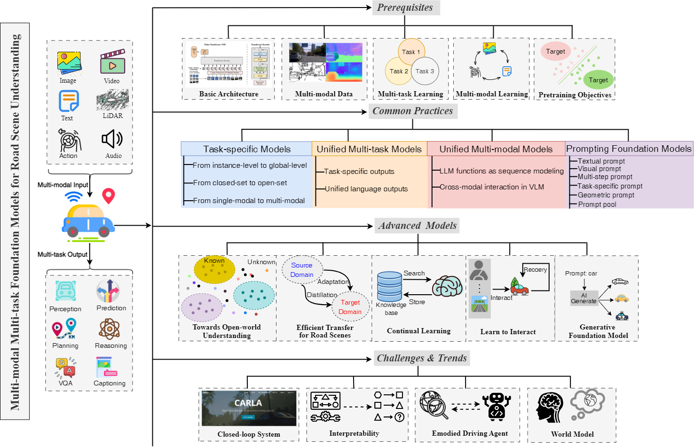
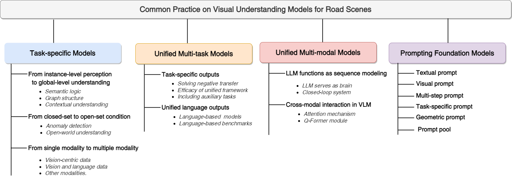
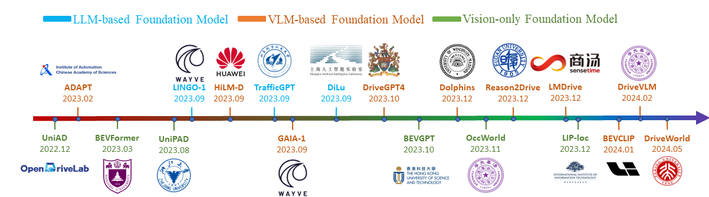

# Delving into Multi-modal Multi-task Foundation Models for Road Scene Understanding: From Learning Paradigm Perspectives
 **Abstract:** Foundation models have indeed made a profound
impact on various fields, emerging as pivotal components that
significantly shape the capabilities of intelligent systems. In the
context of intelligent vehicles, leveraging the power of foundation
models has proven to be transformative, offering notable advancements in visual understanding. Equipped with multi-modal
and multi-task learning capabilities, multi-modal multi-task visual understanding foundation models (MM-VUFMs) effectively
process and fuse data from diverse modalities and simultaneously
handle various driving-related tasks with powerful adaptability,
contributing to a more holistic understanding of the surrounding
scene. In this survey, we present a systematic analysis of MMVUFMs specifically designed for road scenes. Our objective is not
only to provide a comprehensive overview of common practices,
referring to task-specific models, unified multi-modal models,
unified multi-task models, and foundation model prompting
techniques, but also to highlight their advanced capabilities
in diverse learning paradigms. These paradigms include openworld understanding, efficient transfer for road scenes, continual
learning, interactive and generative capability. Moreover, we
provide insights into key challenges and future trends, such as
closed-loop driving systems, interpretability, embodied driving
agents, and world models.

**Authors:** [Sheng Luo](https://github.com/rolsheng), [Wei Chen](https://github.com/PixelChen24), Wanxin Tian, Rui Liu, Luanxuan Hou, Xiubao Zhang, Haifeng Shen,
Ruiqi Wu, Shuyi Geng, Yi Zhou, Ling Shao, Yi Yang, Bojun Gao, Qun Li and Guobin Wu

## 📖Table of Contents
- [Overview](#overview)
- [News](#news)
- [Roadmap](#roadmap) 
- [Paper Collection](#paper-collection)
- [Acknowledgement & Citation](#acknowledgement--citation)

## 😋Overview
This is an overview of our survey as below where we delve into MM-VUFMs from required prerequisites, currently common practices, advanced foundation models from diverse learning paradigms, key challenges and future trends.


We also systematicaly review currently common practices of visual understanding on road scenes from task-specific models, unified multi-task models, unified multi-modal models and prompting foundation models, respectively.


Moreover, advanced capabilities on diverse learning paradigms are highlighted as below, involving open-world understanding, efficient transfer for road scenes, continual learning, learn to interact and generative foundation models, respectively.

## 💥News
- [2024.02.05] Our survey is available at [hear](https://arxiv.org/abs/2402.02968).

## 🗺️Roadmap



## 📚Paper Collection
- [Related Surveys](./papers.md#related-surveys)
- [Task-specific Models](./papers.md#task-specific-models)
  - [From instance-level perception to global-level understanding](./papers.md#from-instance-level-perception-to-global-level-understanding)
  - [From closed-set condition to open-set condition](./papers.md#from-closed-set-condition-to-open-set-condition)
  - [From single modality to multi-modalities](./papers.md#from-single-modality-to-multiple-modalities)
- [Unified Multi-task Models](./papers.md#unified-multi-task-models)
  - [Task-specific outputs](./papers.md#task-specific-outputs)
  - [Unified language outputs](./papers.md#unified-language-outputs)
- [Unified Multi-modal Models](./papers.md#unified-multi-modal-models)
  - [LLM functions as sequence modeling](./papers.md#LLM-functions-as-sequence-modeling)
  - [Cross-modal interaction in VLM](./papers.md#Cross-modal-interaction-in-VLM)
- [Prompting Foundation Models](./papers.md#prompting-foundation-models)
  - [Textual prompt](./papers.md#textual-prompt)
  - [Visual prompt](./papers.md#visual-prompt)
  - [Multi-step prompt](./papers.md#multi-step-prompt)
  - [Task-specific prompt](./papers.md#task-specific-prompt)
  - [Prompt pool](./papers.md#prompt-pool)
- [Related Datasets](./papers.md#datasets)
- [Towards Open-world Understanding](./papers.md#towards-open-world-understanding)
- [Efficient Transfer for Road Scenes](./papers.md#efficient-transfer-for-road-scenes)
- [Continual Learning](./papers.md#continual-learning)
- [Learn to Interact](./papers.md#learn-to-interact)
- [Generative Foundation Models](./papers.md#generative-foundation-models)
- [Closed-loop Driving Systems](./papers.md#closed-loop-driving-systems)
- [Interpretability](./papers.md#interpretability)
- [Embodied Driving Agent](./papers.md#embodied-driving-agent)
- [World Model](./papers.md#world-model)


## 💗Acknowledgement & Citation
This work was supported by DiDi GAIA Research Cooperation Initiative. If you find this work useful, please consider cite:
```
@article{luo2024delving,
  title={Delving into Multi-modal Multi-task Foundation Models for Road Scene Understanding: From Learning Paradigm Perspectives},
  author={Luo, Sheng and Chen, Wei and Tian, Wanxin and Liu, Rui and Hou, Luanxuan and Zhang, Xiubao and Shen, Haifeng and Wu, Ruiqi and Geng, Shuyi and Zhou, Yi and others},
  journal={arXiv preprint arXiv:2402.02968},
  year={2024}
}
```


